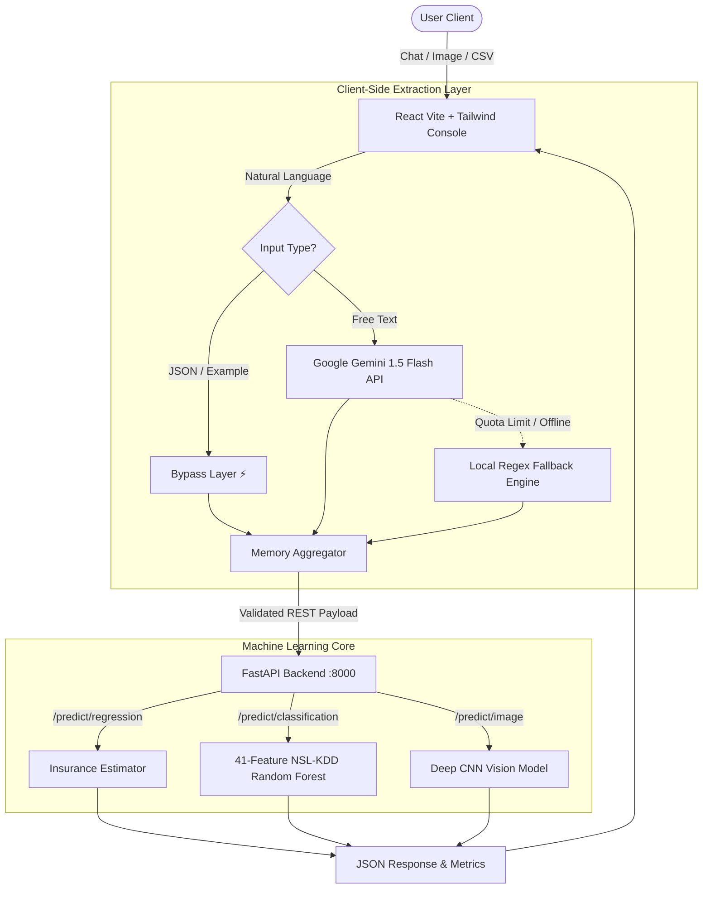

<div align="center">

# 🌌 SPECTRA

### **Unified Multi-Task AI & Machine Learning Console**

*Next-generation predictive inference platform combining Deep Learning Vision, Cyber Defense, and Healthcare Analytics with an adaptive LLM interface.*

---

[-61DAFB?style=for-the-badge\&logo=react\&logoColor=black)](https://reactjs.org/)
[](https://tailwindcss.com/)
[](https://fastapi.tiangolo.com/)
[](https://python.org/)
[](https://ai.google.dev/)
[](https://scikit-learn.org/)

</div>

---

## 📌 Overview

**Spectra** is an intelligent AI console engineered to bridge the gap between traditional Machine Learning pipelines and modern conversational LLMs.

Instead of isolated scripts, Spectra unifies **Computer Vision**, **Cybersecurity Threat Classification**, and **Biomedical Predictive Analytics** into a single, cohesive, dark-themed workspace.

Built with a **3-Tier Hybrid Architecture**, Spectra leverages **Google Gemini 1.5 Flash** for multi-turn natural language extraction, backed by a **Zero-Downtime Deterministic Fallback Engine** that ensures continuous operation even when offline or during quota exhaustion.

---

## 🚀 Key Modules & Capabilities

| Module                           | Task Type                          | Architecture / Dataset                                        | Description                                                                                                               |
| :------------------------------- | :--------------------------------- | :------------------------------------------------------------ | :------------------------------------------------------------------------------------------------------------------------ |
| **🛡️ Intrusion Detection**      | Multiclass / Binary Classification | **Random Forest Pipeline** <br> *NSL-KDD (41 Features)*       | Evaluates raw network packet headers to identify malicious threats such as DoS SYN Floods, Port Scans, and Probe Attacks. |
| **💰 Insurance Cost Estimation** | Numerical Regression               | **Linear Pipeline / Neural Net** <br> *Medical Cost Personal* | Forecasts individual annual insurance charges based on age, BMI, smoking status, and dependents.                          |
| **🥬 Leaf Disease Diagnosis**    | Computer Vision                    | **Deep CNN Classifier** <br> *Lettuce Disease Benchmark*      | Diagnoses plant pathologies from image uploads with top-3 probabilistic confidence ranking.                               |
| **🧠 Adaptive Chat Extractor**   | Natural Language Processing        | **Gemini 1.5 + Memory State**                                 | Extracts structured model parameters across multiple conversation turns without losing context.                           |

---

## 🏛️ System Architecture



---

## 💡 Engineering Highlights

* **Resilient Graceful Degradation:** The client never crashes if the LLM API quota is exceeded. A localized deterministic parser automatically takes over.
* **Full 41-Feature NSL-KDD Alignment:** Dynamic baseline template merging prevents schema mismatch errors such as HTTP 422.
* **Multi-Turn Contextual Memory:** Users can input data progressively—for example, providing age first and smoking status later—without resetting the session state.
* **Strict Real-Time Metric Telemetry:** No synthetic confidence values; probabilities are dynamically extracted from tree voting and softmax layers.

---

## 🛠️ Tech Stack

### Frontend

* React 18
* Vite
* Tailwind CSS
* Lucide Icons

### Backend

* FastAPI
* Uvicorn
* Pydantic v2

### Machine Learning

* Scikit-Learn
* Joblib
* NumPy
* Pandas
* Pillow
* TensorFlow / Keras

### Intelligence

* Google Generative AI
* Gemini 1.5 Flash API

---

## 📦 Getting Started

### 1. Clone the Repository

```bash
git clone https://github.com/YOUR_USERNAME/spectra-ai-console.git
cd spectra-ai-console
```

### 2. Backend Setup

```bash
cd Backend

python -m venv .venv
```

**Windows:**

```bash
.venv\Scripts\activate
```

**Linux / macOS:**

```bash
source .venv/bin/activate
```

Install dependencies:

```bash
pip install -r requirements.txt
```

Start the FastAPI server:

```bash
uvicorn main:app --reload --port 8000
```

### 3. Frontend Setup

From the project root:

```bash
npm install
npm run dev
```

### 4. Environment Configuration

Create a `.env` file in the project root:

```env
VITE_GEMINI_API_KEY=your_gemini_api_key_here
```

---

## 🔐 Security & Reliability

Spectra is designed with reliability and controlled data flow in mind:

* API communication through a dedicated FastAPI backend.
* Structured and validated prediction payloads.
* Deterministic fallback when LLM services are unavailable.
* Session-based conversational memory.
* Isolated machine-learning inference endpoints.
* Environment variables used for API configuration.

> **Important:** Never commit real API keys or secrets to GitHub. Add `.env` to your `.gitignore`.

---

## 📂 Project Structure

```text
spectra-ai-console/
│
├── Backend/
│   ├── main.py
│   ├── models/
│   ├── routes/
│   ├── services/
│   └── requirements.txt
│
├── src/
│   ├── components/
│   ├── pages/
│   ├── services/
│   ├── hooks/
│   └── App.jsx
│
├── public/
├── .env
├── package.json
├── vite.config.js
└── README.md
```

---

## 🔄 Prediction Workflow

```text
User Input
    │
    ▼
React Frontend
    │
    ▼
Input Classification
    │
    ├── Structured Input ──────► Fast Path
    │
    └── Natural Language ─────► Gemini LLM
                                      │
                                      ▼
                              Fallback if Needed
                                      │
                                      ▼
                              Memory Aggregator
                                      │
                                      ▼
                              Validated REST API
                                      │
                                      ▼
                              FastAPI Backend
                                      │
                    ┌─────────────────┼─────────────────┐
                    ▼                 ▼                 ▼
              Regression       Classification      Computer Vision
                    │                 │                 │
                    └─────────────────┼─────────────────┘
                                      ▼
                                JSON Response
                                      │
                                      ▼
                               React Dashboard
```

---

## 🎯 Project Goals

Spectra aims to provide a unified environment where users can interact with multiple AI and Machine Learning systems through a single conversational interface.

The platform focuses on:

* 🤖 Conversational AI interaction
* 📊 Predictive Machine Learning
* 🛡️ Cybersecurity classification
* 👁️ Computer Vision
* 🧠 Context-aware parameter extraction
* ⚡ Reliable inference workflows
* 🔄 Multi-turn interaction

---

## 🧪 Example Use Cases

### Cybersecurity

Provide network traffic features and receive a classification indicating whether the traffic belongs to a known malicious category.

### Healthcare Analytics

Provide demographic and medical-related attributes to estimate insurance costs using a trained regression model.

### Computer Vision

Upload a plant leaf image and receive disease classification probabilities.

### Conversational AI

Interact naturally with the system while progressively providing model parameters across multiple messages.

---

## 📈 Future Improvements

* [ ] Expand the supported Machine Learning models.
* [ ] Add additional cybersecurity datasets.
* [ ] Improve model explainability with feature importance visualization.
* [ ] Add persistent user profiles and prediction history.
* [ ] Introduce model versioning.
* [ ] Add automated model monitoring.
* [ ] Expand multimodal capabilities.
* [ ] Add containerized deployment with Docker.
* [ ] Add automated CI/CD pipelines.

---

## 📄 License

This project is developed for educational and research purposes.

---

<div align="center">

### 🌌 SPECTRA

**One Console. Multiple Models. Intelligent Inference.**

</div>
